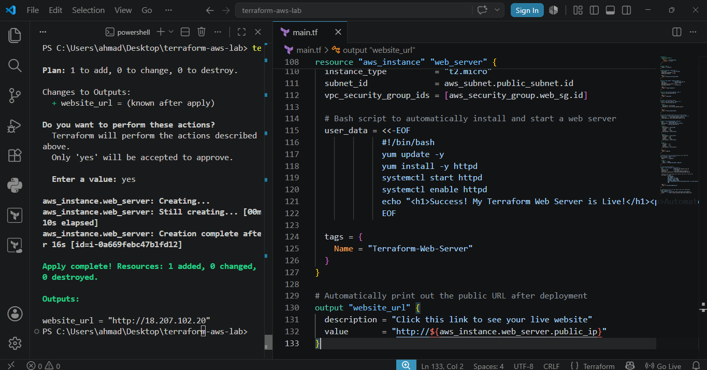
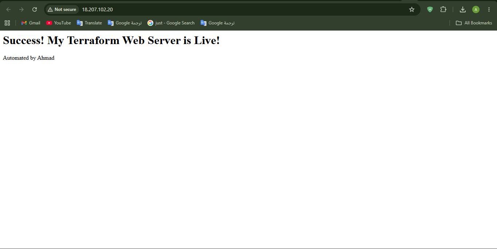
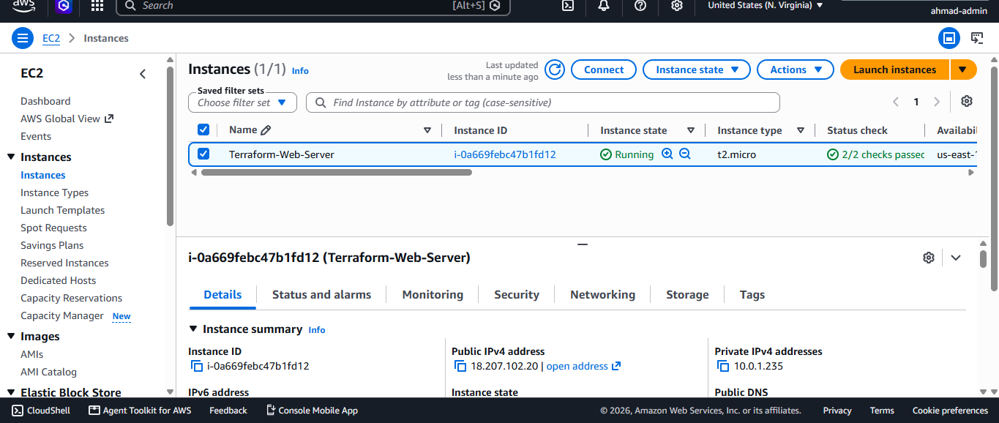
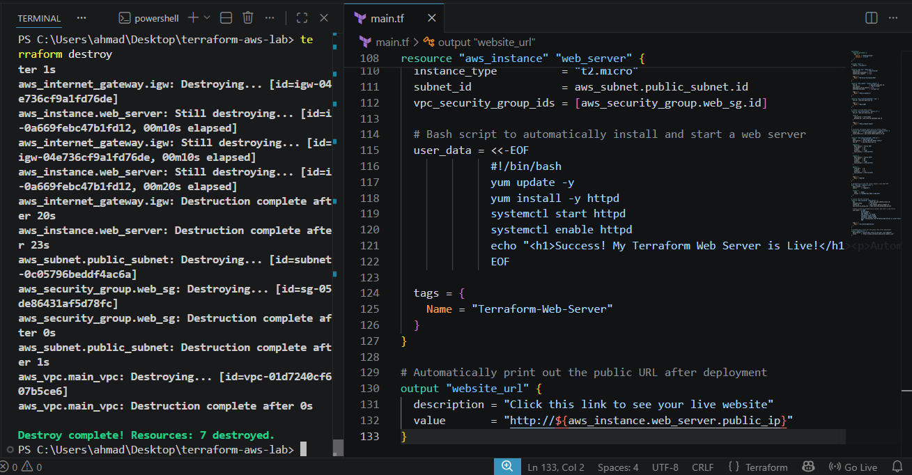

# ☁️ Automated AWS Web Infrastructure Provisioning via Terraform

### 📌 Project Overview
This project demonstrates the use of **Infrastructure as Code (IaC)** to provision a highly available, custom network and web server environment on Amazon Web Services (AWS). It showcases the ability to architect, deploy, and dismantle cloud infrastructure using HashiCorp **Terraform**, completely bypassing the manual AWS Management Console.

---

### 🛠️ Key Technical Implementations

#### 1. Custom Virtual Private Cloud (VPC)
* Designed a custom VPC network from scratch (`10.0.0.0/16`) to isolate the environment from the default AWS networking stack.
* Provisioned a Public Subnet (`10.0.1.0/24`) mapped to an availability zone.
* Attached an Internet Gateway (IGW) and configured a Custom Route Table to enable public outbound routing.

#### 2. Security & Firewall Rules
* Deployed an EC2 Security Group acting as a stateful firewall.
* Configured inbound (ingress) rules to allow HTTP (Port 80) and SSH (Port 22) traffic globally.

#### 3. Automated Compute & Web Server Deployment
* Utilized Terraform **Data Blocks** to dynamically query and fetch the latest Amazon Linux 2023 AMI ID.
* Provisioned an EC2 `t2.micro` instance within the custom Public Subnet.
* Injected a **User Data bash script** during the boot process to automatically update packages, install Apache (`httpd`), and launch a custom HTML web page.

#### 4. Infrastructure Lifecycle Management
* Validated resource deployment state via CLI output variables and browser testing.
* Demonstrated proper cloud cost management by executing full environment teardown using `terraform destroy`.

---

### 📊 Deployment Verification

*Screenshots demonstrating the automated lifecycle:*

